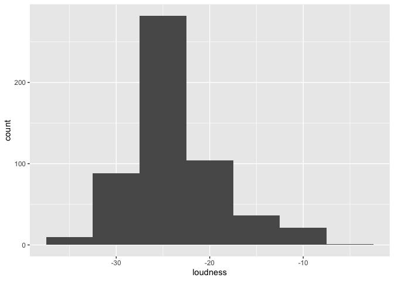
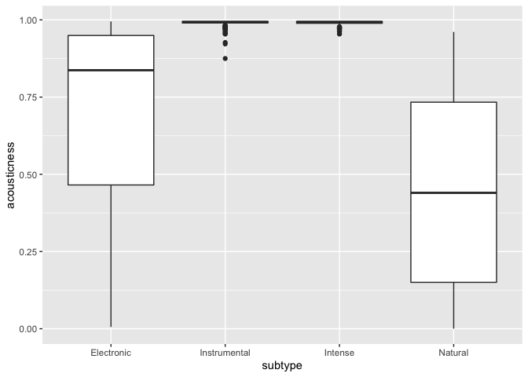
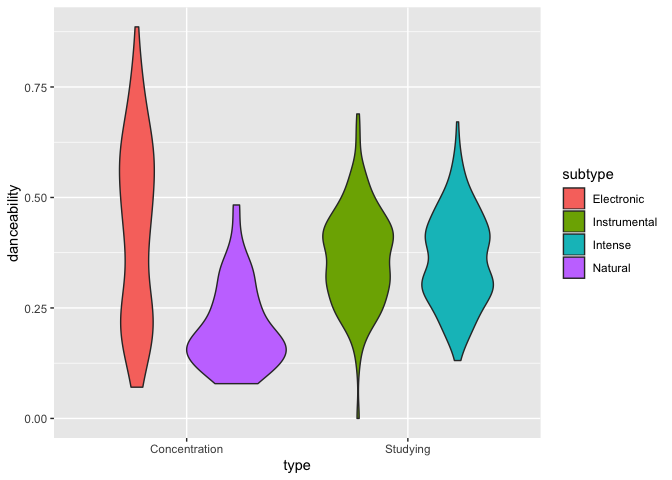
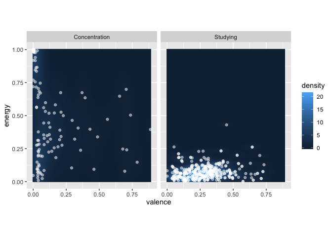

Exploring the Spotify API
================

## 1\. Install the necessary packages.

  - For this week, we need to have the `tidyverse` and `spotifyr`
    packages installed.

## 2\. Create a `spotify.R` file to hide your login credentials (optional).

  - Download the [sample `spotify.R`](./spotify.R) and save it to your
    project directory.
  - Add `spotify.R` as a new line at the end of your `.gitignore` file,
    which you can find in the Files pane.

## 3\. Set up R.

  - Use the RStudio Code menu to insert a new R chunk.
  - Load the `tidyverse` and `spotifyr` libraries.
  - Use the `source` command to load `spotify.R`.

<!-- end list -->

``` r
library(tidyverse)
```

    ## ── Attaching packages ────────────────────────────────────────────────────────────────── tidyverse 1.3.0 ──

    ## ✓ ggplot2 3.2.1     ✓ purrr   0.3.3
    ## ✓ tibble  2.1.3     ✓ dplyr   0.8.3
    ## ✓ tidyr   1.0.2     ✓ stringr 1.4.0
    ## ✓ readr   1.3.1     ✓ forcats 0.4.0

    ## ── Conflicts ───────────────────────────────────────────────────────────────────── tidyverse_conflicts() ──
    ## x dplyr::filter() masks stats::filter()
    ## x dplyr::lag()    masks stats::lag()

``` r
library(spotifyr)
source('spotify.R')
```

## 4\. Download and view features for your playlists.

  - Collect the most listened tracks for each member in your group, from
    the [Spotify Wrapped](https://open.spotify.com/genre/2019-page)
    page.

<!-- end list -->

``` r
spotify_features <-
  ## Use the tribble() function to give one-word labels for your playlists, e.g.,
  ## type and subtype, or group member and year, plus the URIs for the Spotify
  ## user and playlist. Often the user is just 'spotify'.
  tribble(
    ~type, ~subtype, ~user, ~playlist,
    'Studying', 'Instrumental', 'spotify', '37i9dQZF1DX9sIqqvKsjG8',
    'Studying', 'Intense', 'spotify', '37i9dQZF1DX8NTLI2TtZa6',
    'Concentration', 'Electronic', 'spotify', '37i9dQZF1DX3XuTDjo5z5z',
    'Concentration', 'Natural', 'spotify', '37i9dQZF1DWYFCj3KyU0r0'
  ) %>% 
  ## This line downloads the features from Spotify.
  mutate(features = map2(user, playlist, get_playlist_audio_features)) %>% 
  ## Use the select() function to keep your label columns, plus the features.
  select(type, subtype, features) %>% 
  ## This line expands the features into a single table.
  unnest(features)
```

## 5\. Explore statistical summaries.

  - Use summarisation and grouping commands to explore the values of the
    Spotify features.

  - `min()`

  - `max()`

  - `mean()`

  - `median()`

  - `sd()`

  - `IQR()`

  - Compare your results with the distribution of features in the
    Spotify documentation.

  - Remember to think of differences in terms of standard deviations. As
    a rule of thumb, differences

  - \< 0.2 SD are considered too trivial to be of scientific interest,

  - > 0.2 SD but \< 0.5 SD are considered scientifically relevant but
    > small,

  - > 0.5 SD but \< 0.8 SD are considered medium-sized, and

  - > 0.8 SD are considered large, perhaps so large that there was no
    > need to conduct an experiment.

<!-- end list -->

``` r
spotify_features %>% 
  ## Try different features and different summary functions.
  summarise(M = mean(danceability, SD = sd(danceability)))
```

    ## # A tibble: 1 x 1
    ##       M
    ##   <dbl>
    ## 1 0.361

``` r
spotify_features %>% 
  ## Try grouping by group member and/or year.
  group_by(type, subtype) %>% 
  ## Try different features and different summary functions.
  summarise(M = mean(danceability, SD = sd(danceability)))
```

    ## # A tibble: 4 x 3
    ## # Groups:   type [2]
    ##   type          subtype          M
    ##   <chr>         <chr>        <dbl>
    ## 1 Concentration Electronic   0.430
    ## 2 Concentration Natural      0.207
    ## 3 Studying      Instrumental 0.365
    ## 4 Studying      Intense      0.360

## 6\. Explore with visualisations.

  - We will learn more about visualisations later in the course, but
    here are some templates you can use to start with.
  - See the [`ggplot` documentation](https://ggplot.tidyverse.org/) for
    more examples.

<!-- end list -->

``` r
spotify_features %>% 
  ggplot(aes(x = loudness)) +
  geom_histogram(binwidth = 5)
```

<!-- -->

``` r
spotify_features %>% 
  ggplot(aes(x = subtype, y = acousticness)) +
  geom_boxplot()
```

<!-- -->

``` r
spotify_features %>% 
  ggplot(aes(x = type, y = danceability, fill = subtype)) +
  geom_violin()
```

<!-- -->

``` r
spotify_features %>% 
  ggplot(aes(x = valence, y = energy)) + 
  facet_wrap(~ type) +
  stat_density_2d(
    geom = 'raster', 
    aes(fill = stat(density)), 
    contour = FALSE
  ) + 
  geom_jitter(colour = 'white', alpha = 0.5) + 
  coord_equal()
```

<!-- -->

## 7\. Push to Github.

  - Use the Knit button in RStudio to preview how your page will look.
  - Follow the directions in *Happy Git*, [Sections 16.4
    to 16.7](https://happygitwithr.com/existing-github-first.html#stage-and-commit)
    to stage, commit, and push your changes to Github.
  - After several minutes (and possibly several page refreshes), your
    changes should be visible from the github.io link you made earlier.
