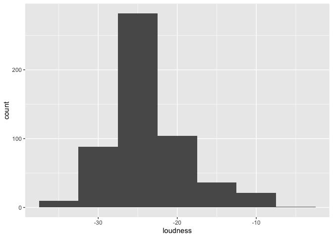
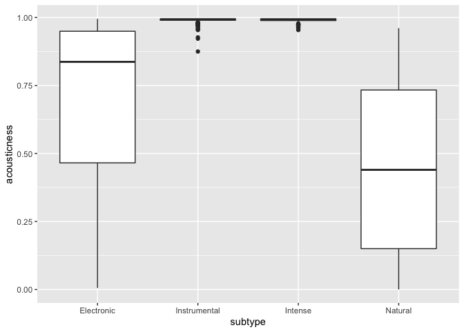
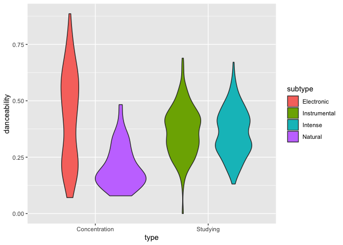
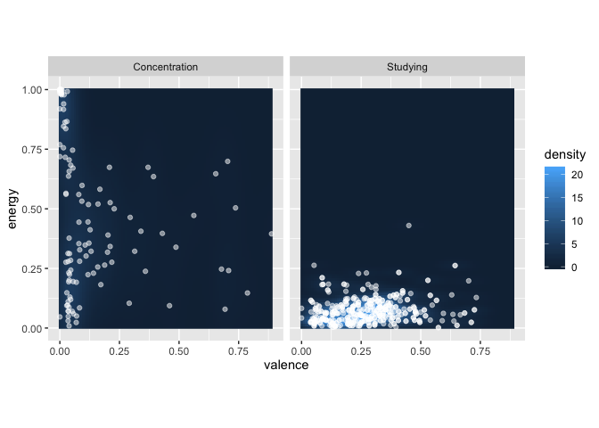

Working with Spotify
================
John Ashley Burgoyne
Week 8

## Getting started with Github

### 1\. Create a Github account.

  - See *Happy Git*,
    [Chapter 4](https://happygitwithr.com/github-acct.html).

### 2\. Create a repository.

  - See *Happy Git*,
    [Section 15.1](https://happygitwithr.com/new-github-first.html), for
    the basics.
  - While creating the repository, two extra steps will make future
    course work easier.
  - Check the box to ‘Initialize this Repository with a README.’
  - Set the ‘Add .gitignore’ button to R.
  - Leave the ‘Add a license’ button alone for now.

### 3\. Add a licence (optional).

  - From your Github repository page, click the ‘Create new file’
    button.
  - Name the file ‘LICENSE’, using all capitals.
  - [Choose a licence](https://choosealicense.com) and copy its text to
    the clipboard.
  - *My recommendation is CC-BY-4.0, which is accessible from ‘My
    project isn’t software.’*
  - Click the green ‘Commit new file’ button at the bottom of the page.

### 4\. Make the repository a web page.

  - From your Github repository page, click the Settings tab.
  - Under the Github Pages heading, change the Source button from ‘None’
    to ‘master branch’.
  - Github should now say that your site is published and give a link to
    its web page. Use this link for submitting homework assignments and
    the final portfolio.

## Linking Github to RStudio

### 1\. Initialise your Git installation.

  - If you have not been using Git regularly before, initialise your Git
    installation using the instructions in *Happy
    Git*,[Chapter 7](https://happygitwithr.com/hello-git.html).

### 2\. Clone your Github repository to an R project.

  - Follow the directions in *Happy Git*,
    [Section 16.2](https://happygitwithr.com/existing-github-first.html).
  - You can get the repository URL of your Github repository by clicking
    the green ‘Clone or download’ button from your repository page.
  - Be sure to save your R project in a place that you can find it
    again\! You will need to open it every time you want to work on your
    project in the future (although you can usually also find it in the
    RStudio File menu under Recent Projects).

### 3\. Create README.Rmd.

  - From the RStudio File menu, create a new R Markdown file from the
    Github Document template.
  - Use [Github
    Markdown](https://guides.github.com/features/mastering-markdown/) to
    edit the home page as you wish.
  - Use the Knit button in RStudio to preview how your page will look.

### 4\. Push your changes to Github.

  - Follow the directions in *Happy Git*, [Sections 16.4
    to 16.7](https://happygitwithr.com/existing-github-first.html#stage-and-commit)
    to stage, commit, and push your changes to Github.
  - After several minutes (and possibly several page refreshes), your
    changes should be visible from the link you made in Step 4.

## Explore the Spotify API

### 1\. Install the necessary packages.

  - For this week, we need to have the `tidyverse` and `spotifyr`
    packages installed.

### 2\. Create a `spotify.R` file to hide your login credentials (optional).

  - Download the [sample `spotify.R`](./spotify.R) and save it to your
    project directory.
  - Add `spotify.R` as a new line at the end of your `.gitignore` file,
    which you can find in the Files pane.

### 3\. Set up R.

  - Use the RStudio Code menu to insert a new R chunk.
  - Load the `tidyverse` and `spotifyr` libraries.
  - Use the `source` command to load `spotify.R`.

### 3\. Download and view features for your playlists.

  - Collect the most listened tracks for each member in your group, from
    the [Spotify Wrapped](https://open.spotify.com/genre/2019-page)
    page.

<!-- end list -->

``` r
spotify_features <-
  ## Use the tribble() function to give one-word labels for your playlists, e.g.,
  ## type and subtype, or group member and year, plus the URIs for the Spotify
  ## user and playlist. Often the user is just 'spotify'.
  tribble(
    ~type, ~subtype, ~user, ~playlist,
    'Studying', 'Instrumental', 'spotify', '37i9dQZF1DX9sIqqvKsjG8',
    'Studying', 'Intense', 'spotify', '37i9dQZF1DX8NTLI2TtZa6',
    'Concentration', 'Electronic', 'spotify', '37i9dQZF1DX3XuTDjo5z5z',
    'Concentration', 'Natural', 'spotify', '37i9dQZF1DWYFCj3KyU0r0'
  ) %>% 
  ## This line downloads the features from Spotify.
  mutate(features = map2(user, playlist, get_playlist_audio_features)) %>% 
  ## Use the select() function to keep your label columns, plus the features.
  select(type, subtype, features) %>% 
  ## This line expands the features into a single table.
  unnest(features)
```

### 4\. Explore statistical summaries.

  - Use summarisation and grouping commands to explore the values of the
    Spotify features.

  - `min()`

  - `max()`

  - `mean()`

  - `median()`

  - `sd()`

  - `IQR()`

  - Compare your results with the distribution of features in the
    Spotify documentation.

  - Remember to think of differences in terms of standard deviations. As
    a rule of thumb, differences

  - \< 0.2 SD are considered too trivial to be of scientific interest,

  - > 0.2 SD but \< 0.5 SD are considered scientifically relevant but
    > small,

  - > 0.5 SD but \< 0.8 SD are considered medium-sized, and

  - > 0.8 SD are considered large, perhaps so large that there was no
    > need to conduct an experiment.

<!-- end list -->

``` r
spotify_features %>% 
  ## Try different features and different summary functions.
  summarise(M = mean(danceability, SD = sd(danceability)))
```

    ## # A tibble: 1 x 1
    ##       M
    ##   <dbl>
    ## 1 0.361

``` r
spotify_features %>% 
  ## Try grouping by group member and/or year.
  group_by(type, subtype) %>% 
  ## Try different features and different summary functions.
  summarise(M = mean(danceability, SD = sd(danceability)))
```

    ## # A tibble: 4 x 3
    ## # Groups:   type [2]
    ##   type          subtype          M
    ##   <chr>         <chr>        <dbl>
    ## 1 Concentration Electronic   0.430
    ## 2 Concentration Natural      0.207
    ## 3 Studying      Instrumental 0.365
    ## 4 Studying      Intense      0.360

### 5\. Explore with visualisations.

  - We will learn more about visualisations later in the course, but
    here are some templates you can use to start with.
  - See the [`ggplot` documentation](https://ggplot.tidyverse.org/) for
    more examples.

<!-- end list -->

``` r
spotify_features %>% 
  ggplot(aes(x = loudness)) +
  geom_histogram(binwidth = 5)
```

<!-- -->

``` r
spotify_features %>% 
  ggplot(aes(x = subtype, y = acousticness)) +
  geom_boxplot()
```

<!-- -->

``` r
spotify_features %>% 
  ggplot(aes(x = type, y = danceability, fill = subtype)) +
  geom_violin()
```

<!-- -->

``` r
spotify_features %>% 
  ggplot(aes(x = valence, y = energy)) + 
  facet_wrap(~ type) +
  stat_density_2d(
    geom = 'raster', 
    aes(fill = stat(density)), 
    contour = FALSE
  ) + 
  geom_jitter(colour = 'white', alpha = 0.5) + 
  coord_equal()
```

<!-- -->

### 6\. Push to Github.

  - Use the Knit button in RStudio to preview how your page will look.
  - Follow the directions in *Happy Git*, [Sections 16.4
    to 16.7](https://happygitwithr.com/existing-github-first.html#stage-and-commit)
    to stage, commit, and push your changes to Github.
  - After several minutes (and possibly several page refreshes), your
    changes should be visible from the link you made in Step 4.
